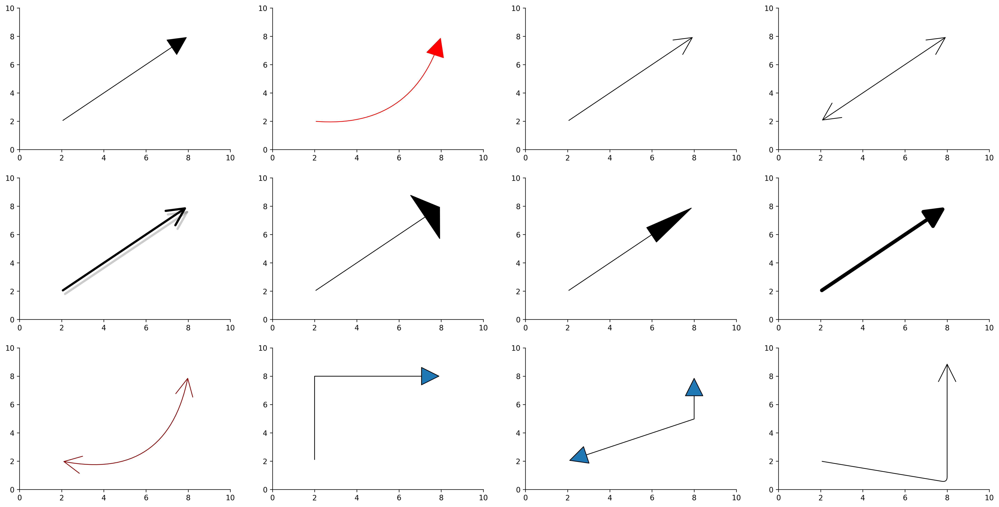

# drawarrow


Drawing arrows for `matplotlib` made easy.

Check out [the online documentation](https://python-graph-gallery.com/drawarrow/).

<br><br>

# Installation

_Note: drawarrow requires **Python 3.9** or above._

You can install `drawarrow` directly from PyPI with:

```
pip install drawarrow
```

<br><br>

# Quick Start

```python
import matplotlib.pyplot as plt
from drawarrow import fig_arrow

fig, ax = plt.subplots()

ax.scatter(x=[1, 2, 3, 4, 5], y=[1, 2, 3, 4, 5], s=100)

fig_arrow(
    head_position=(0.5, 0.5),
    tail_position=(0.2, 0.7),
    width=2,
    radius=0.3,
    color="darkred",
    fill_head=False,
    mutation_scale=2,
)

plt.show()
```


<br><br>

# Usage guide

Check out [the online documentation](https://python-graph-gallery.com/drawarrow/).

Features overview:



<br><br>

# Contributions

Contributions (and feedback) are welcome.

### TODO features:

There's not much that needs to be implemented at the moment. If you've found a bug or want to request a new feature, open an [issue](https://github.com/JosephBARBIERDARNAL/drawarrow/issues).

### Installation for contributions

_Note: drawarrow requires **Python 3.9** or above._

Follow the steps below for your OS.

1. **Fork the Repository:**
   Fork this repository to your GitHub account.

2. **Clone the Repository:**

   ```bash
   git clone https://github.com/yourusername/drawarrow.git
   cd drawarrow
   ```

3. **Set Up a Virtual Environment:**

   - **Mac/Linux:**
     ```bash
     python -m venv venv
     source venv/bin/activate
     ```
   - **Windows:**
     ```cmd
     python -m venv venv
     venv\Scripts\activate
     ```

4. **Install Dependencies:**

   ```bash
   pip install -r requirements.txt
   pip install -e .
   ```

5. **Create a Feature Branch:**

   ```bash
   git checkout -b feature-name
   ```

6. **Start Coding!**

<br><br><br>
