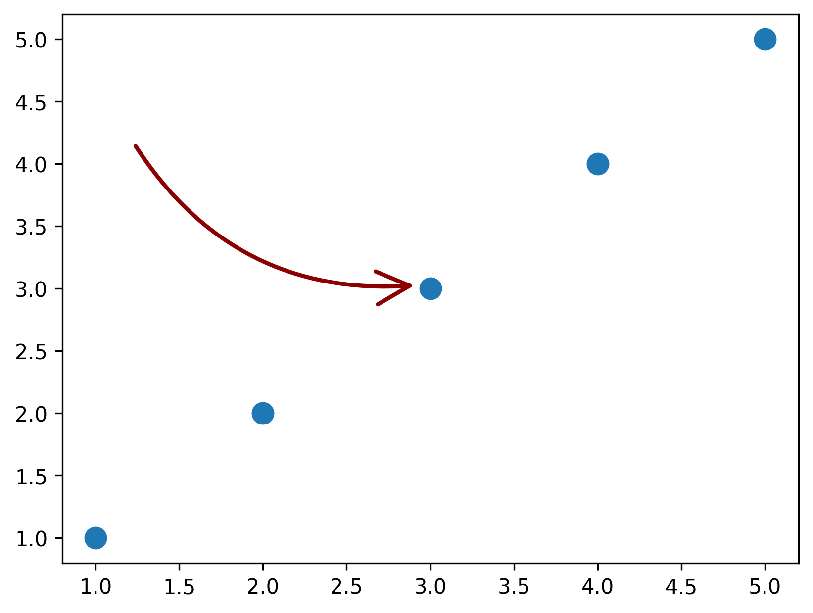

# drawarrow

Draw arrows for matplotlib

<br><br>

# Installation

```bash
pip install git+https://github.com/JosephBARBIERDARNAL/drawarrow.git
```

<br><br>

# Quick Start

```python
import matplotlib.pyplot as plt
from drawarrow import fig_arrow

fig, ax = plt.subplots()

ax.scatter(x=[1, 2, 3, 4, 5], y=[1, 2, 3, 4, 5], s=100)

fig_arrow(head_position=(0.5, 0.5), tail_position=(0.2, 0.7), fig=fig, color="r")

plt.show()
```



<br><br>

# Usage guide

`drawarrow` provides 2 functions:

- `fig_arrow()`: draw an arrow on a Matplotlib figure (e.g. the whole chart)
- `ax_arrow()`: draw an arrow on Matplotlib axe (e.g. a subplot)

The difference between mainly lies in their coordinates. An arrow on a Figure would usually be between 0 and 1 for both x and y axis. However, when drawing an arrow on an Axes, it's on the data coordinates.

Those functions have a set a common arguments:

- `tail_position`: position of the tail of the arrow (on the figure/axes)
- `head_position`: position of the head of the arrow (on the figure/axes)
- `invert` (bool, default to False): whether to invert or not the angle of the arrow (only used if `radius`!=0)
- `radius` (float, default to 0.1):
- `color`: color of the arrow,
- `tail_width` (float, default to 0.5): Width of the tail of the arrow
- `head_width` (float, default to 4): Head width of the tail of the arrow
- `head_length` (float, default to 8): Head length of the tail of the arrow
- `linewidth` (float, default to 0.5): Width of the body of the arrow

<br>

## `ax_arrow()`

This function is recommended when what you want to highlight is related to the data itself, such as a specific point in a scatter plot.

### Minimalist usage

```python
import matplotlib.pyplot as plt
from drawarrow import ax_arrow

fig, ax = plt.subplots()
ax.scatter(x=[1, 5, 10], y=[5, 12, 3])
ax_arrow((2, 8), (8, 2), ax=ax, color="blue", radius=0.3)
plt.show()
```


### Usage with multiple subplots

```python
import matplotlib.pyplot as plt
from drawarrow import ax_arrow

fig, axs = plt.subplots(ncols=3, nrows=3)

for ax in axs.flat:
    ax.set_xlim(0, 10)
    ax.set_ylim(0, 10)
    ax.set_xticks([])
    ax.set_yticks([])

    ax_arrow((2, 2), (8, 8), ax=ax, color="red", radius=0.4)
plt.show()
```


<br>

## `fig_arrow()`

### Minimalist usage

This function is recommended when what you want to highlight something that is more global and not data specific.

```python
import matplotlib.pyplot as plt
from drawarrow import fig_arrow

fig, ax = plt.subplots()
fig_arrow((0.3, 0.3), (0.8, 0.8), fig=fig)

plt.show()
```


### More complex usage

```python
import matplotlib.pyplot as plt
from drawarrow import fig_arrow

fig, ax = plt.subplots()
fig_arrow(
    (0.3, 0.3),
    (0.8, 0.8),
    color="#2a9d8f",
    tail_width=2,
    head_length=20,
    head_width=10,
    linewidth=2,
    radius=0.7,
    invert=True,
    fig=fig,
)

plt.show()
```


<br><br>

## Contributions

Contributions (and feedback) are welcome.

TODO features:

- control opacity (alpha parameter in matplotlib)
- draw arrow with an inflection point (see [this](https://python-graph-gallery.com/web-stacked-area-with-inflexion-arrows/))
- ...

#### Installation for contributions

- Fork this repo
- `git clone https://github.com/yourusername/drawarrow.git`
- `cd drawarrow`
- `pip install -r requirements.txt`
- `pip install -e .`
- `git checkout -b feature-name`
- start coding!

<br><br><br>
